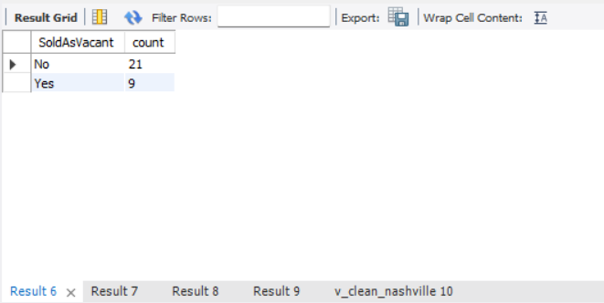
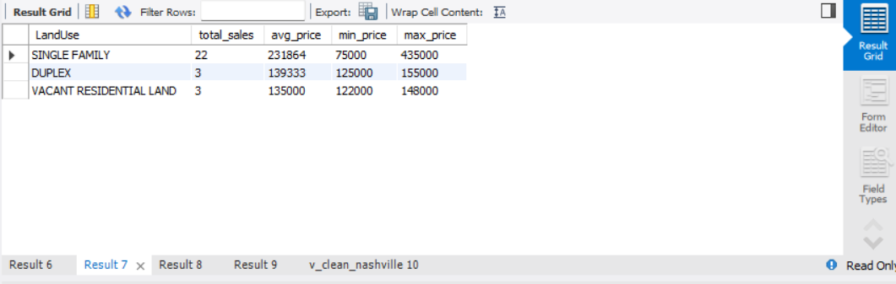
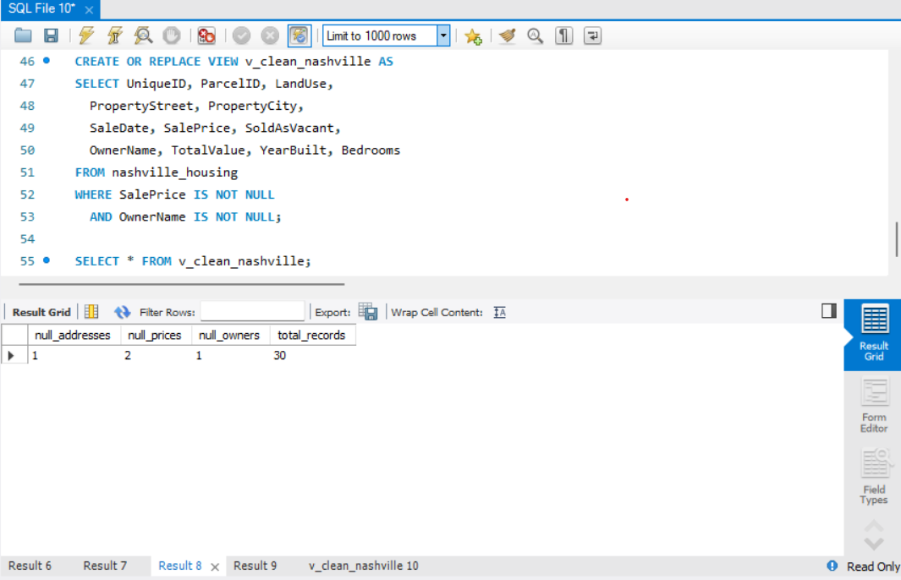
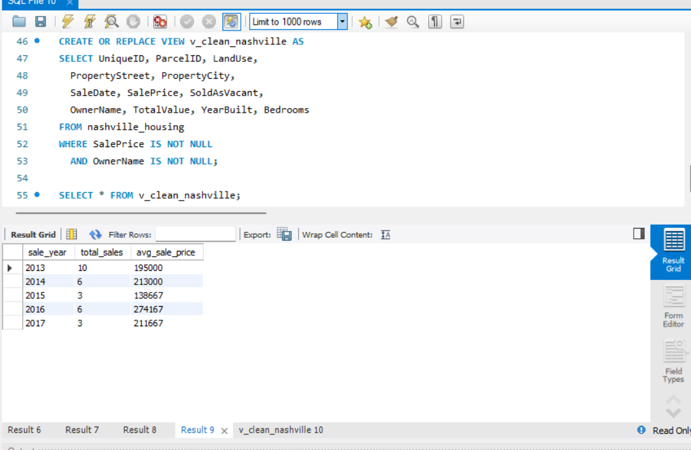
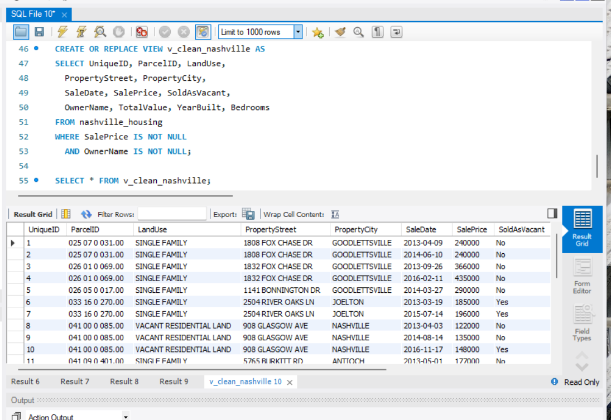

# Nashville Housing Data Cleaning — SQL

## Project Overview
Real-world data cleaning project on Nashville housing 
sales data using MySQL — identifying and fixing NULL values, 
standardising inconsistent data, splitting address fields, 
and building a clean reporting view.

## Business Problem
Raw property sales data contained NULL addresses, inconsistent 
Y/N flags, and unstructured address fields — making it unusable 
for reporting. This project cleans and standardises the dataset 
for downstream analytics.

## Tools & Skills
- MySQL — UPDATE, JOIN, CASE, ALTER TABLE, CREATE VIEW
- Data Cleaning: NULL handling, string manipulation, deduplication
- Data Standardisation: consistent formatting across all fields

## Key Results
- Fixed NULL property addresses using ParcelID matching
- Standardised SoldAsVacant: Y/N → Yes/No across 30 records
- Split PropertyAddress into Street + City columns
- Identified: 1 null address, 2 null prices, 1 null owner name
- Price trend: Nashville avg sale price rose from $195K (2013) 
  to $274K (2016) — 40% increase over 3 years
- Created clean SQL View (v_clean_nashville) with 28 verified records

## Screenshots

## Author
**Kabilan Ramachandran**  
linkedin.com/in/kabilan-ramachandran  
github.com/kabilanramachandran
